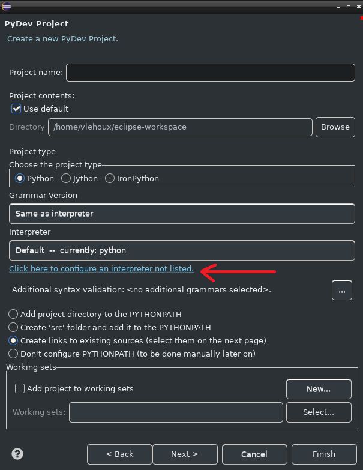
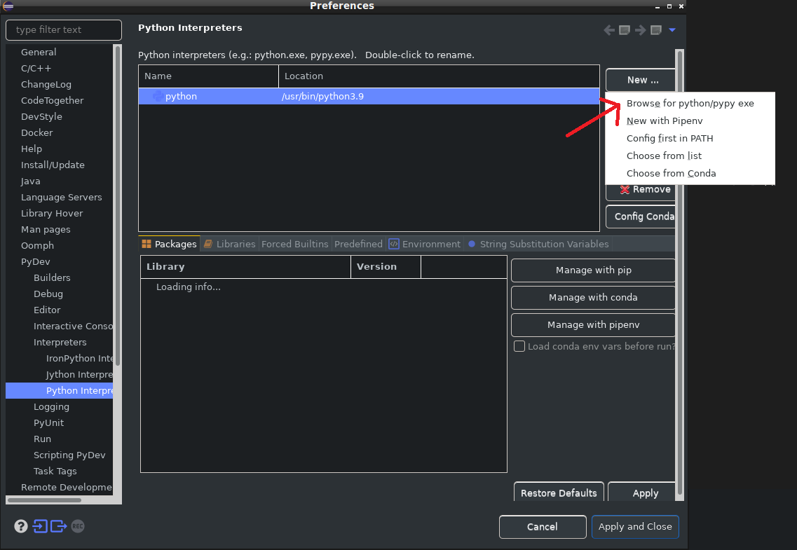

# Getting started

## 1. Installing python and virtualenv

### Windows

Download Python 3.9 installer from [here](https://www.python.org/downloads/).
Customize the installation directory for example to `C:\Python39\`
At the end of the installation, check the boxes "define as the default PYTHON" and "add to PATH"

Checking that the installation was ok:

```bash
> where python
C:\Python39\python.exe

> python --version
Python 3.X.y
```

Now install virtualenv

```bash
> pip install virtualenv
```

### Linux

On Linux targets, use the default package manager. For example: 

```bash
> sudo apt update
> sudo apt install python3-pip
> python --version
Python 3.X.y
```

Source: https://linuxize.com/post/how-to-install-pip-on-ubuntu-18.04/#installing-pip-for-python-3

Now install virtualenv

```bash
> python3.9 -m pip install virtualenv
```

### Mac

It seems that the Linux procedure should work on Mac.


## 2. Creating a virtual enviroment

By default `virtualenv` will create the environment in the local folder.

```bash
> python3.9 -m virtualenv miageTd
```

We have to activate an environment before using it

```bash
(windows)
> miageTd/Scripts/activate.bat

(linux)
> source miageTd/bin/activate
```

Now we can check that the python used is the correct one:

```bash
(windows)
(miageTd) > where python
<...>/miageTd/bin/python.exe

(linux)
(miageTd) > which python
<...>/miageTd/bin/python
```

You can leave a virtual environment with:

```bash
(miageTd) > deactivate
> 
```

## 3. Installing a package with pip

Installing a package is done using `pip`. 
Warning: Make sure to activate your virtualenv before installing a package !

```bash
(miageTd) > pip install numpy
Collecting numpy
  Downloading numpy-1.23.1-cp39-cp39-win_amd64.whl (14.7 MB)
     ---------------------------------------- 14.7/14.7 MB 16.8 MB/s eta 0:00:00
Installing collected packages: numpy
Successfully installed numpy-1.23.1
```

You can check that the package has correctly been installed:

```
(miageTd) > pip list
Package    Version
---------- -------
numpy      1.23.1
pip        22.1.2
setuptools 62.6.0
wheel      0.37.1
```


## 4. Listing all your requirements

When you wish to share your code with others, you may wish to provide them also a snapshot of all your installed package versions - just in case.
For this simply do

```bash
(miageTd) > pip freeze
numpy==1.23.1
```

You can save this list in a file named ```requirements.txt``` that can then be used with pip to initialize an environment with the same libraries.

```bash
(miageTd) > pip install -r requirements.txt
```


## 5. Binding your IDE with the virtualenv

### PyCharm

How to configure the virtual environment with PyCharm is described [here](https://www.jetbrains.com/help/pycharm/creating-virtual-environment.html).

### Eclipse

In Eclipse, you need to select a PyDev version, for instance from [the Eclipse marketplace](https://marketplace.eclipse.org/content/pydev-python-ide-eclipse).


You can then create a PyDev project and directly set the python interpreter to correspond to the python environment. 
For this, click on adding an interpreter not listed



and select 'Open interpreter preference page' and create a new one from the python executable in your ```miageTd/  bin``` folder.




### VSCode

There is a description [here](https://code.visualstudio.com/docs/python/environments)

### Jupyter

To install Jupyter lab, follow the installation instructions [here](https://jupyter.org/install).


#### In linux

To use a specific virtual environment with Jupyter lab, you need to create a kernel corresponding to the virtual environment.

For this, first install ```ipykernel```
ipykernel in your virtual environment.

```bash
(miageTd) > pip install ipykernel
```

In the kernel folder of jupyter (e.g. ~/local/share/jupyter/kernels), add a folder ```miageTd```.
The command ```jupyter --paths``` displays the paths for jupyter.
The one you want should be in data

```bash
:~$ jupyter --paths
config:
    /home/my_user_name/.jupyter
    /usr/etc/jupyter
    /usr/local/etc/jupyter
    /etc/jupyter
data:
    /home/my_user_name/.local/share/jupyter
    /usr/local/share/jupyter
    /usr/share/jupyter
runtime:
    /home/my_user_name/.local/share/jupyter/runtime
```

In this folder, add a kernel.json file containing the path to the binary of the python environment:

```json
{
 "argv": [
  "/home/my_user_name/path_to_env/miageTd/bin/python3",
  "-m",
  "ipykernel_launcher",
  "-f",
  "{connection_file}"
 ],
 "display_name": "miageTd",
 "language": "python"
}
```

Run jupyter lab where you want to save your files and choose the new kernel.

```
jupyter lab
```
